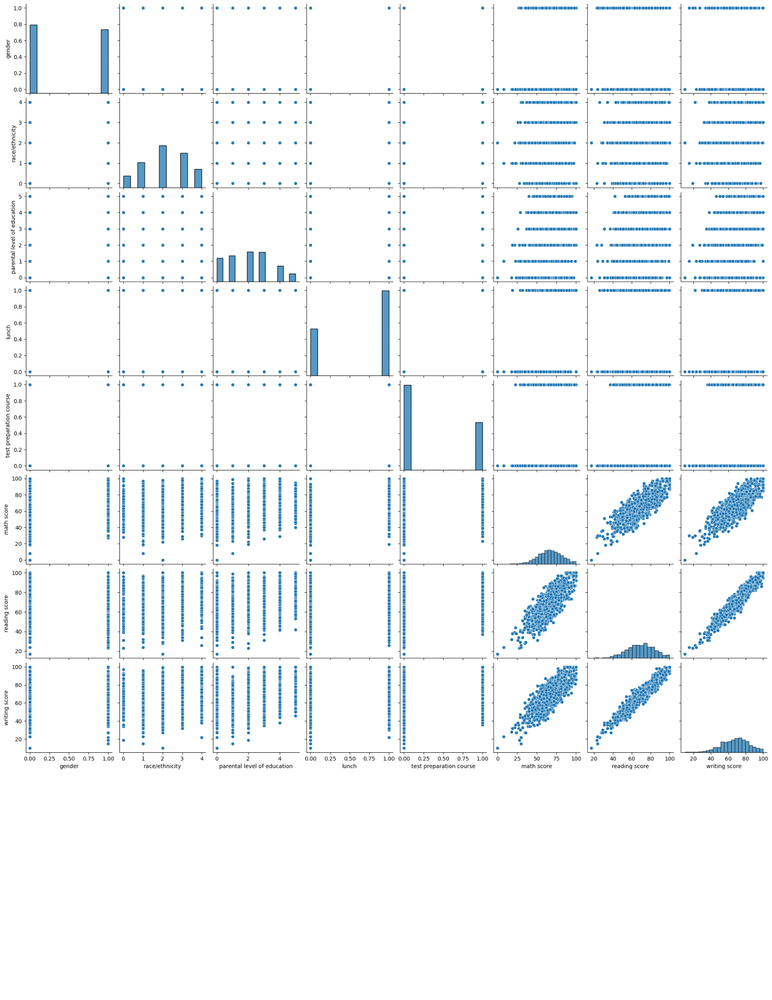
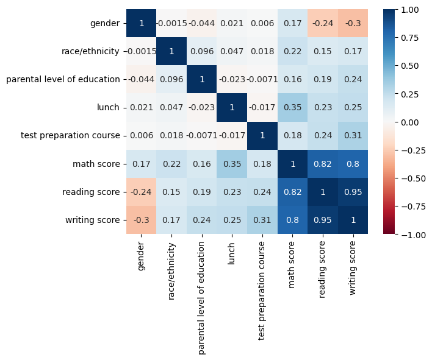
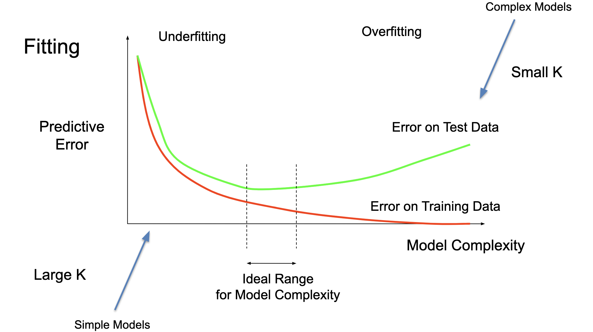
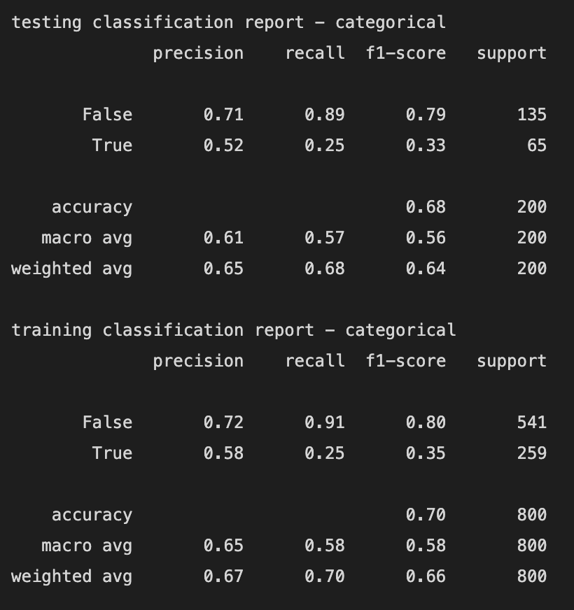
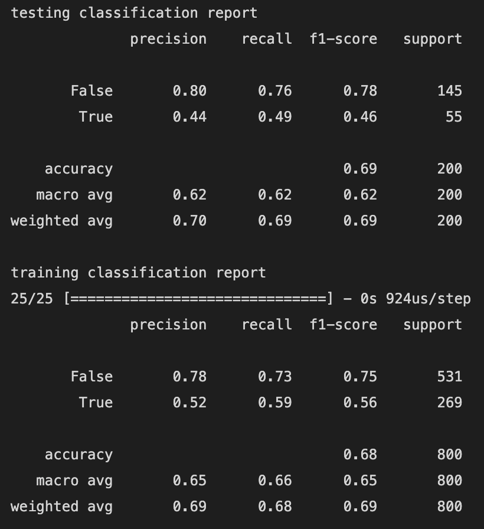

# ECS-171-Final-Project

## Group Members
Pengcheng Cao, Zahira Ghazali, Denise Kwong, Sophie Mi, Lingfeng Pan, Zihan Wang

# Introduction

## Abstract
The dataset we are using records the standardized test scores of high school students in the United States in various subjects and some personal identification details of each student. (https://www.kaggle.com/datasets/spscientist/students-performance-in-exams)

NOTE: the data was created by Royce Kimmons, who created it as a fictional data set. So all the observations are generated and do not represent real people.

In this project, we would like to use this data to understand the influence of the parents' background, test preparation, and other factors on a student's performance on high school standardized tests in order to create a model to predict how well students will do in the future.

Additionally, this will help us gain a better understanding as to why admissions officers argued standardized testing isn't a fair measure of admissions.

# Figures
## Equations used for comparing error
- Precision = $\frac{TP}{TP + FP}$
- Recall = $\frac{TP}{TP + FN}$
- Accuracy = $\frac{TP + TN}{TP + FP + TN + FN}$
- Mispredictions = $\frac{FP + FN}{TP + FP + TN + FN}$
## ```pairplot``` with all dataset attributes

## ```heatmap``` displaying the correlation coefficients of all dataset attributes

## graph showing how to compare training and testing error to determine overfitting/underfitting


# Methods
## Data Exploration
### Observing Data
In this dataset, we have 1000 total observations. Running the `info()` command, we can see that our data has 1000 rows of non-null data for each column.

The column names of our data are: 
- Gender: student’s gender
- Race/Ethnicity: Represented by the groups defined in the Data Dictionary on National Codes for ethnicity that are as follows:
- Parental Level of Education: The 6 levels of education that the parents of the student could have are:
- Lunch: whether the student received standard or free/reduced lunch, which also provides an indicator of the student’s financial background
- Test preparation course: whether or not the student took and completed a test preparation course for exams
- Math Score: the student's score achieved on the math section of the standardized test
- Reading Score: the student’s score achieved on the reading section of the standardized test
- Writing Score: the student’s score achieved on the writing section of the standardized test

### Plots
We then used ```seaborn``` display all of the attributes in a [pairplot](#pairplot-with-all-dataset-attributes), and calculated their correlation coefficients in a [heatmap](#heatmap-displaying-the-correlation-coefficients-of-all-dataset-attributes).


## Preprocessing
We preprocessed the data by changing categorical data to numerical or boolean values. For instance, in the case of gender - male was set to true and female to false. This was also done for the other attributes that contained qualitative data, such as lunch, test preparation courses, race/ethnicity, and parental level of education so that we could represent them as qualitative data. For race/ethnicity, we mapped the values by alphabetical order of groups, while for the parental level of education, we set the value from the lowest to the highest degree.

Transforms completed:
- gender
    - male: 1
    - female: 0
- lunch
    - standard: 1
    - free/reduced: 0
- test preparation course
    - completed: 1
    - none: 0
- race/ethnicity
    - Group A (White - British): 0
    - Group B (White - Irish): 1
    - Group C (White - Any other White background): 2
    - Group D (Mixed - White and Black Caribbean): 3
    - Group E (Mixed - White and Black African): 4
    - Group F (Mixed - White and Asian): 5
    - Group G (Mixed - Any other mixed background): 6

- parental level of education
    - some high school: 0
    - high school: 1
    - some college: 2
    - associate's degree: 3
    - bachelor's degree: 4
    - master's degree: 5

### Target
In standardized testing, the final score is reported as the average of the individual sections, thus, we created another column called ```avg score``` that averaged the math, reading, and writing section scores of each student. We then used this average score to define our target, ```passed```. We define pass to be if the student achieves a score higher than 75, which is approximately a letter grade of C.

## First Model
The first model we used was a Naive Bayes Classifier. We first split the data into two parts, the categorical attributes, and the numerical attributes (the test scores). We then scaled the numerical data using `MinMaxScaler()` and split up both parts separately into our training and testing sets with a ratio of 80:20, and average score as the y. We fit a Categorical Naive Bayes to the categorical test data and logged the accuracy, then a Gaussian Naive Bayes for the numerical test data. We then compared the testing and training errors using classification reports and calculations to determine the effectiveness of the models.

## Second Model
The second model we employed was a Neural Net using Keras. First, we split the data into the training and testing sets with a ratio of 80:20. We then used `Sequential()` to initialize the NN. The overall input dimension was 5 and we added 4 layers: one with 16 units and a `relu` activation function, another with 8 units and a `tanh` function, another with 6 units and a `linear` function, and the last sigmoid layer with 1 node. The loss was `binary_crossentropy`, and we ran the model for 50 epochs. We then thresholded the data such that 0.5 and above was considered to be reasonable (or 1), with the rest of the results representing 0. After applying XNOR to the attained `yhat_test` and `y_test` values, we summed the total predictions that were correct and incorrect. To view the degree of accuracy for our model, we printed out a confusion matrix and classification report.

# Results
## First Model
The testing accuracy of the Naive Bayes Classifier model was 68.0%. The training accuracy of the Naive Bayes Classifier model was 70.0%

The full classification report is 

Using these [equations](#equations-used-for-comparing-error) on the training and testing set, we get the following results:
Testing Set:
- total positive = 31
- total negative = 200 - 31 = 169

- true positive = 16
- false positive = 31 - 16 = 15

- true negative = 120
- false negative = 169 - 120 = 49

Training Set
- total positive = 113
- total negative = 800 - 113 = 687

- true positive = 65
- false positive = 113 - 65 = 48

- true negative = 493
- false negative = 687 - 493 = 194

The misprediction for our training set was 0.3025 and the misprediction for our testing set was 0.32. 

## Second Model
The testing accuracy of the Neural Net model was 69.0%. The training accuracy of the Neural Net model was 68.0%.

The full classification report is 

Using these [equations](#equations-used-for-comparing-error) on the training and testing set, we get the following results:
Testing Set:
- total positive = 62
- total negative = 200 - 62 = 138

- true positive = 27
- false positive = 62 - 27 = 35

- true negative = 110
- false negative = 138 - 110 = 28

Training Set
- total positive = 305
- total negative = 800 - 305 = 495

- true positive = 160
- false positive = 305 - 160 = 145

- true negative = 386
- false negative = 495 - 386 = 109

The misprediction for our training set was 0.3175 and the misprediction for our testing set was 0.315.

## Final Model
The final model we picked was our First Model.

# Discussion
## Data Exploration
We discovered that our dataset does not have any null data, so in our preprocessing, there is no need to drop any null data. 

Since we wanted to see the effect of changing each of the categorical attributes on the scores, we also did not drop any columns in preprocessing.

Some of the initial trends we saw from the [pairplot](#pairplot-with-all-dataset-attributes) and [heatmap](#heatmap-displaying-the-correlation-coefficients-of-all-dataset-attributes) were:
- There is a high linear correlation between the test scores of the three different sections: math, reading, and writing
- The scatter plots of test scores with the rest of the attributes show a very high level of clustering, but looking at the correlation coefficients, there appears to be no correlation between the attributes
- There was no correlation between test prep, gender, race/ethnicity, parental level of education, lunch

## Preprocessing
Looking at the correlation values of the heatmap from our data exploration, the relationship between the categorical attributes is not as good as expected, and there were no specific attributes that show a high correlation, we concluded that any linear, polynomial or logistic regression model will not be a good fit. Thus, when creating our model, we plan to proceed with trying a classification model, an SVM, Neural Net, or unsupervised models to best represent our data.

The last part of preprocessing was choosing a target to reflect what we wanted to predict from our model - which was the probability of test success. Thus, because standardized testing reports the final score as the average of the individual sections, we created another column called ```avg score``` that averaged the math, reading, and writing section scores of each student. We then used this average score to define another column ```passed``` to be our target column. 

We define ```passed``` to be if the student achieves a score higher than 75, which is approximately a letter grade of C.

## First Model
We chose to use a Naive Bayes Classifier as our first model. Since our dataset contained both categorical and numerical attributes, we fit a Categorical Naive Bayes Classifier on the categorical attributes only. We then also fit a Gaussian Naive Bayes Classifier on the numerical attributes, but since the numerical attributes are the individual section scores that we directly used to obtain our target attribute, we expected this to be highly accurate - thus, we do our comparison of training and testing error primarily using the Categorical Naive Bayes Classifier.

### Comparing Training vs Testing Error for First Model
The predictive error is higher for the testing set than the training set, since the misprediction for our training set was 0.3025 and the misprediction for our testing set was 0.32. So according to the fitting graph, our model is likely overfitting or is close to a good fit, and if near or on the [right of the ideal range for model complexity](#graph-showing-how-to-compare-training-and-testing-error-to-determine-overfittingunderfitting).

## Second Model
To improve on our first model, we introduce Keras to define a Neural Network. Since none of the categorical attributes showed much correlation, we hoped that increasing the complexity with a neural net and adding layers would help define a more accurate model.

After testing we find the 4 layers separately with ```relu```, ```tanh```, ```linear``` and ```sigmoid``` as activation is expected to have highest accuracy.

### Comparing Training vs Testing Error for Second Model
The predictive error of the training set is equal to the testing, with a training set misprediction of 0.3175 and a testing set misprediction of 0.315. So, according to the fitting graph, our model is underfitting the data and is on the [far left of the ideal range for model complexity](#graph-showing-how-to-compare-training-and-testing-error-to-determine-overfittingunderfitting).

# Conclusion
## Summary of Results
We created two models to try and predict whether the student "passed" or failed the standardized test. This metric was created by taking the average of all three scores used and seeing if it was over 75% (our passing value). If it was, the student "passed", else the student failed. 
Since we used avg score instead of separate three scores, we only considered a single measure of success in standardized tests. So in future models, we would like to predict them separately and see if the attributes in our dataset may have different correlations with different scores as well.

The first model we used was a Naive Bayes Classifier with a testing accuracy 68% and training accuracy of 70%. The second model we used was a Neural Net model with a testing accuracy of 69.0% and a training accuracy of 68.0%. Overall, while the two models performed well, with high accuracies, we concluded that the first model, our Naive Bayes Classifier, performed better. We concluded this because when identifying the model complexity for both models, we found that our first model was either a good fit or overfit, while our second model was underfit.

One model that we'd like that we try in the future is clustering, which we think may reveal more similarities if we are not bounded by the given class labels.

However, we noticed very little overall correlation in our model, so we cannot conclude that the parents' background, test preparation, and other factors affect a student's performance on high school standardized tests.

It is worth noting that our model was created on a fictional dataset, so our model having no correlation cannot be used to justify why standardized testing is no longer used in college admissions.

# Collaboration
We completed each section of this project with all team members present on a voice call. Live coding does not work very well with running jupyter notebook plots, so we shared screen on one PC and all contributed code and ideas.

Sophie was the team leader of our group, gathering all members of the group to meet and facilitating communications, as well as directing the focus of the group and leading coding sessions.

